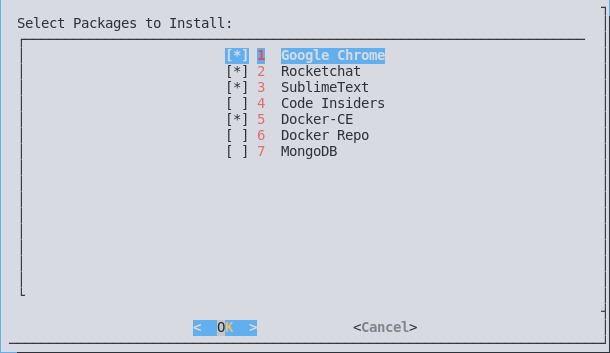

# Software Stack Installation Script

## Usage:

* Install and Update Listed Programs.
    > * Google Chrome
    > * Rocket Chat
    > * Sublime Text
    > * Code Insiders
    > * Docker-CE
    > * MongoDB
* Download and Install packages not provided through package repositories, .e.g Rocketchat, Code Insiders
* Check for Updates for Rocket chat and Code Insiders and Install them if any available.


#### Install all regular programs

* It will fetch and run scripts directly from the web using curl
* So first of all we need to install curl

###### For Debian Based Distros
```sudo apt-get -qq update && sudo apt-get -y -qq install curl```

###### For Fedora Based Distros
```sudo dnf -y install curl```

#### Beginning the Installation

* After installing curl you can now run the following command to begin the setup.
* You'll be prompted to enter branch to be used: (Default is "master")

> `develop` *branch is for development purposes only, use with caution you might end up with a buggy codes*

```/bin/bash -c "$(curl -sL https://raw.githubusercontent.com/drpdishant/shell-scripts/master/setup.sh)"```

* You will be prompted to Select Required Packages.
#
* Installation will check for Updates if Packages Already Exist and Install them if any update is availabe.
* Select the Programs of your choice and hit **`Enter`**

